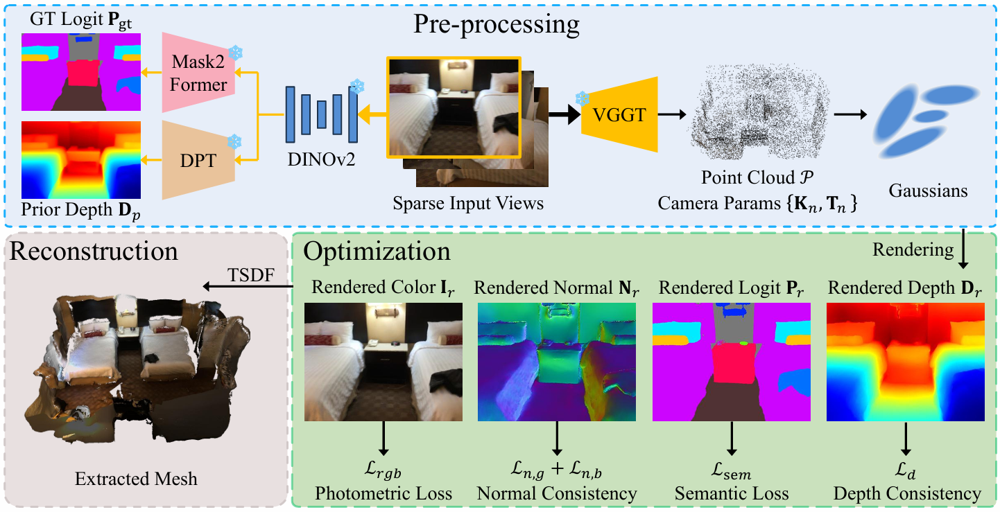

<div align="center">

  <h1 align="center">AlignGS: Aligning Geometry and Semantics for Robust Indoor Reconstruction from Sparse Views</h1>
  

[Yijie Gao](https://gaoyijie-sjtu.github.io/), [Houqiang Zhong](https://waveviewer.github.io/), Tianchi Zhu, Zhengxue Cheng, Qiang Hu✉, Li Song✉ <br />


### [[`Project Page`](https://mediax-sjtu.github.io/AlignGS/)] [[`Paper`](http://arxiv.org/abs/2510.07839)]
</div>

<!-- <p align="center">

</p> -->

## Abstract

The demand for semantically rich 3D models of indoor scenes is rapidly growing, driven by 
applications in augmented reality, virtual reality, and robotics. However, creating them 
from sparse views remains a challenge due to geometric ambiguity. Existing methods often 
treat semantics as a passive feature painted on an already-formed, and potentially flawed, geometry. 
We posit that for robust sparse-view reconstruction, semantic understanding instead be an active, guiding force. 
This paper introduces AlignGS, a novel framework that actualizes this vision by pioneering a 
synergistic, end-to-end optimization of geometry and semantics. Our method distills rich priors from 
2D foundation models and uses them to directly regularize the 3D representation through 
a set of novel semantic-to-geometry guidance mechanisms, including depth consistency and 
multi-faceted normal regularization. Extensive evaluations on standard benchmarks demonstrate 
that our approach achieves state-of-the-art results in novel view synthesis and produces 
reconstructions with superior geometric accuracy. The results validate that leveraging 
semantic priors as a geometric regularizer leads to more coherent and complete 3D models from 
limited input views.

## Overview
<p align="center">

</p>

We present the overview of the AlignGS pipeline, starting with initialization and 
the subsequent geometry and semantics joint optimization. This framework enables 
the end-to-end joint optimization of all geometric and semantic attributes of the 
Gaussian primitives, ensuring a synergistic refinement of both the scene's geometric 
structure and its semantic understanding.

## Updates

- [2025.11.24]: Code version0 release

## Environment Setup

```shell
git clone https://github.com/MediaX-SJTU/AlignGS.git
cd AlignGS

conda create -n AlignGS python=3.8
conda activate AlignGS

pip install torch torchvision torchaudio --index-url https://download.pytorch.org/whl/cu118 #replace your cuda version
pip install -r requirements.txt
pip install submodules/diff-plane-rasterization
pip install submodules/diff-gaussian-rasterization-feature
pip install submodules/simple-knn
```
## Data Preparation

### Data structure

We expect the following dataset structure in the source path location:
```shell
<location>
├── scene_1/
│   ├── images/                     # indoor few-shot rgb images
│   │   ├── <image 0>.png
│   │   ├── <image 1>.png
│   │   └── ...
│   ├── sparse/                     # camera params and sparse point cloud generated from pretrained vggt, used for reconstruction
│   │   ├── cameras.bin
│   │   ├── images.bin
│   │   └── points3D.bin
│   ├── pred_depths/                # depth maps generated from pretrained dinov2 + dpt 
│   │   ├── <image 0>.npy
│   │   ├── <image 1>.npy
│   │   └── ...
│   ├── segmentation_logits/        # segmentation logits generated from pretrained dinov2 + mask2former
│   │   ├── <image 0>.pt
│   │   ├── <image 1>.pt
│   │   └── ...
│   ├── pose/                       # raw camera extrinsics, only used for mesh cleaning
│   │   ├── <image 0>.txt
│   │   ├── <image 1>.txt
│   │   └── ...
│   ├── intrinsic_depth.txt         # raw camera intrinsics, only used for mesh cleaning
│   └── <GT mesh>.ply               # ground truth mesh
├── scene_2/
└── ... 
```

### Data Preparation

The raw indoor scene datasets we used can be downloaded from [ScanNet](https://github.com/ScanNet/ScanNet) and [NRGBD](). Following the RGB data processing steps in [NeuRIS](https://github.com/jiepengwang/NeuRIS), we downsample the raw RGB images via resizing and uniform interval sampling.

### Initial point cloud & Camera parameters

Please refer to [VGGT](https://github.com/facebookresearch/vggt) for obtaining sparse 3D point cloud and camera params, the results will be saved under `scene_name/sparse` in the COLMAP format.

### Depths maps & Segmentation logits

Please refer to [DINOv2](https://github.com/facebookresearch/dinov2) for obtaining depth maps and segmentation logits. We save the depth maps in the `.npy` format under `scene_name/pred_depths`, and the segmentation logits in the `.pt` format under `scene_name/segmentation_logits`.

## Citation
If you find this project useful in your research, please consider cite:

```
@misc{Gao_2025_VCIP,
      title={AlignGS: Aligning Geometry and Semantics for Robust Indoor Reconstruction from Sparse Views}, 
      author={Yijie Gao and Houqiang Zhong and Tianchi Zhu and Zhengxue Cheng and Qiang Hu and Li Song},
      year={2025},
      eprint={2510.07839},
      archivePrefix={arXiv},
      primaryClass={cs.CV},
      url={http://arxiv.org/abs/2510.07839}, 
}
```

